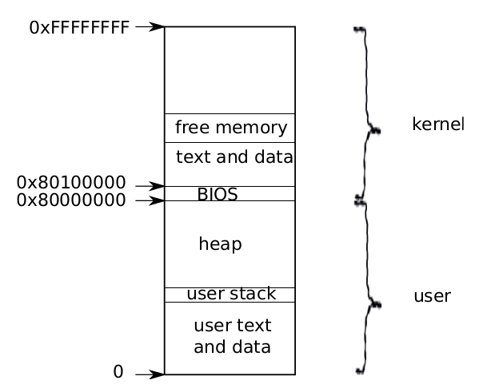
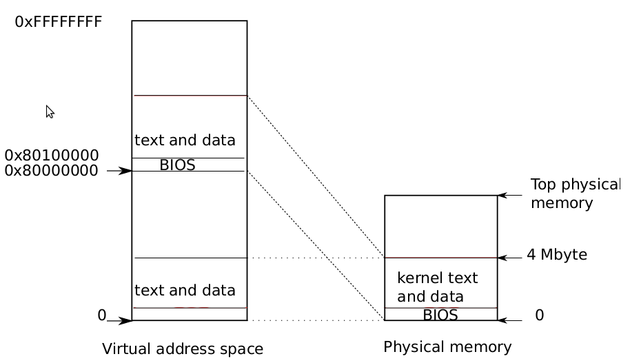
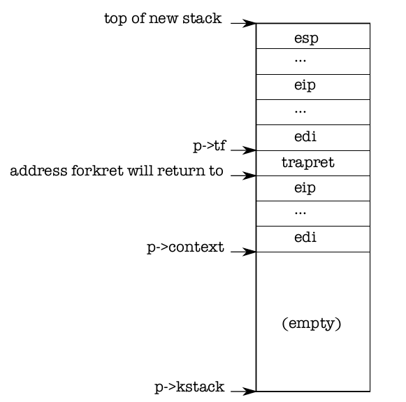

**************************************
Chapter 1 The first process
**************************************

This chapter explains what happens when xv6 first starts running, through thecreation of the first process. In doing so, the text provides a glimpse of the implementation of all major abstractions that xv6 provides, and how they interact. Most of xv6avoids specialcasing the first process, and instead reuses code that xv6 must providefor standard operation. Subsequent chapters will explore each abstraction in more detail.

Xv6 runs on Intel 80386 or later (‘‘x86’’) processors on a PC platform, and muchof its low-level functionality (for example, its process implementation) is x86-specific.This book assumes the reader has done a bit of machine-level programming on somearchitecture, and will introduce x86-specific ideas as they come up. Appendix A brieflyoutlines the PC platform.

Process overview
=================

A process is an abstraction that provides the illusion to a program that it has itsown abstract machine. A process provides a program with what appears to be a private memory system, or address space, which other processes cannot read or write.A process also provides the program with what appears to be its own CPU to executethe program’s instructions.

Xv6 uses page tables (which are implemented by hardware) to give each processits own address space. The x86 page table translates (or ‘‘maps’’) a virtual address(the address that an x86 instruction manipulates) to a physical address (an addressthat the processor chip sends to main memory).

Xv6 maintains a separate page table for each process that defines that process’saddress space. As illustrated in Figure 1-1, an address space includes the process’suser memory starting at virtual address zero. Instructions come first, followed by global variables, then the stack, and finally a ‘‘heap’’ area (for malloc) that the process canexpand as needed.

Each process’s address space maps the kernel’s instructions and data as well as theuser program’s memory. When a process invokes a system call, the system call executes in the kernel mappings of the process’s address space. This arrangement existsso that the kernel’s system call code can directly refer to user memory. In order toleave room for user memory to grow, xv6’s address spaces map the kernel at high addresses, starting at 0x80100000.

The xv6 kernel maintains many pieces of state for each process, which it gathersinto a struct proc (2103). A process’s most important pieces of kernel state are itspage table, its kernel stack, and its run state. We’ll use the notation p->xxx to refer toelements of the proc structure.

    Figure 1-1. Layout of a virtual address space

Each process has a thread of execution (or thread for short) that executes theprocess’s instructions. A thread can be suspended and later resumed. To switch transparently between processes, the kernel suspends the currently running thread and resumes another process’s thread. Much of the state of a thread (local variables, functioncall return addresses) is stored on the thread’s stacks. Each process has two stacks: auser stack and a kernel stack (p->kstack). 

When the process is executing user instructions, only its user stack is in use, and its kernel stack is empty. When the process enters the kernel (via a system call or interrupt), the kernel code executes on theprocess’s kernel stack; while a process is in the kernel, its user stack still contains saveddata, but isn’t actively used. A process’s thread alternates between actively using theuser stack and the kernel stack. The kernel stack is separate (and protected from usercode) so that the kernel can execute even if a process has wrecked its user stack.When a process makes a system call, the processor switches to the kernel stack,raises the hardware privilege level, and starts executing the kernel instructions that implement the system call. When the system call completes, the kernel returns to userspace: the hardware lowers its privilege level, switches back to the user stack, and resumes executing user instructions just after the system call instruction. A process’sthread can ‘‘block’’ in the kernel to wait for I/O, and resume where it left off when theI/O has finished.

p->state indicates whether the process is allocated, ready to run, running, waiting for I/O, or exiting.

p->pgdir holds the process’s page table, in the format that the x86 hardware expects. xv6 causes the paging hardware to use a process’s p->pgdir when executingthat process. A process’s page table also serves as the record of the addresses of thephysical pages allocated to store the process’s memory.

Code: the first address space
=============================

    Figure 1-2. Layout of a virtual address space

When a PC powers on, it initializes itself and then loads a boot loader from diskinto memory and executes it. Appendix B explains the details. Xv6’s boot loader loadsthe xv6 kernel from disk and executes it starting at entry (1040). The x86 paging hardware is not enabled when the kernel starts; virtual addresses map directly to physicaladdresses.

The boot loader loads the xv6 kernel into memory at physical address 0x100000.The reason it doesn’t load the kernel at 0x80100000, where the kernel expects to findits instructions and data, is that there may not be any physical memory at such a highaddress on a small machine. The reason it places the kernel at 0x100000 rather than0x0 is because the address range 0xa0000:0x100000 contains I/O devices.

To allow the rest of the kernel to run, entry sets up a page table that maps virtual addresses starting at 0x80000000 (called KERNBASE (0207)) to physical addresses starting at 0x0 (see Figure 1-1). Setting up two ranges of virtual addresses that map to thesame physical memory range is a common use of page tables, and we will see moreexamples like this one.

The entry page table is defined in main.c (1311). We look at the details of page tables in Chapter 2, but the short story is that entry 0 maps virtual addresses0:0x400000 to physical addresses 0:0x400000. This mapping is required as long asentry is executing at low addresses, but will eventually be removed.

Entry 960 maps virtual addresses KERNBASE:KERNBASE+0x400000 to physical addresses 0:0x400000. This entry will be used by the kernel after entry has finished; itmaps the high virtual addresses at which the kernel expects to find its instructions anddata to the low physical addresses where the boot loader loaded them. This mappingrestricts the kernel instructions and data to 4 Mbytes.

Returning to entry, it loads the physical address of entrypgdir into control register %cr3. The paging hardware must know the physical address of entrypgdir, because it doesn’t know how to translate virtual addresses yet; it doesn’t have a page tableyet. The symbol entrypgdir refers to an address in high memory, and the macroV2P_WO (0220) subtracts KERNBASE in order to find the physical address. To enable thepaging hardware, xv6 sets the flag CR0_PG in the control register %cr0.

The processor is still executing instructions at low addresses after paging is enabled, which works since entrypgdir maps low addresses. If xv6 had omitted entry 0from entrypgdir, the computer would have crashed when trying to execute the instruction after the one that enabled paging.

Now entry needs to transfer to the kernel’s C code, and run it in high memory.First it makes the stack pointer, %esp, point to memory to be used as a stack (1054). Allsymbols have high addresses, including stack, so the stack will still be valid evenwhen the low mappings are removed. Finally entry jumps to main, which is also ahigh address. The indirect jump is needed because the assembler would otherwisegenerate a PC-relative direct jump, which would execute the low-memory version ofmain. Main cannot return, since the there’s no return PC on the stack. Now the kernelis running in high addresses in the function main (1217).

Code: creating the first process
================================

After main initializes several devices and subsystems, it creates the first process bycalling userinit (1239). Userinit’s first action is to call allocproc. The job of allocproc (2205) is to allocate a slot (a struct proc) in the process table and to initialize the parts of the process’s state required for its kernel thread to execute. Allocprocis called for each new process, while userinit is called only for the very first process.Allocproc scans the proc table for a slot with state UNUSED (2211-2213). When it findsan unused slot, allocproc sets the state to EMBRYO to mark it as used and gives theprocess a unique pid (2201-2219). Next, it tries to allocate a kernel stack for the process’skernel thread. If the memory allocation fails, allocproc changes the state back to UNUSED and returns zero to signal failure.

Now allocproc must set up the new process’s kernel stack. allocproc is writtenso that it can be used by fork as well as when creating the first process. allocprocsets up the new process with a specially prepared kernel stack and set of kernel registers that cause it to ‘‘return’’ to user space when it first runs. The layout of the prepared kernel stack will be as shown in Figure 1-3. allocproc does part of this workby setting up return program counter values that will cause the new process’s kernelthread to first execute in forkret and then in trapret (2236-2241). The kernel threadwill start executing with register contents copied from p->context. Thus setting p->context->eip to forkret will cause the kernel thread to execute at the start offorkret (2533). This function will return to whatever address is at the bottom of thestack. The context switch code (2708) sets the stack pointer to point just beyond theend of p->context. allocproc places p->context on the stack, and puts a pointer totrapret just above it; that is where forkret will return. trapret restores user registers from values stored at the top of the kernel stack and jumps into the process (3027).This setup is the same for ordinary fork and for creating the first process, though inthe latter case the process will start executing at user-space location zero rather than at a return from fork.

    Figure 1-3. A new kernel stack.

As we will see in Chapter 3, the way that control transfers from user software tothe kernel is via an interrupt mechanism, which is used by system calls, interrupts, andexceptions. Whenever control transfers into the kernel while a process is running, thehardware and xv6 trap entry code save user registers on the process’s kernel stack.userinit writes values at the top of the new stack that look just like those that wouldbe there if the process had entered the kernel via an interrupt (2264-2270), so that the ordinary code for returning from the kernel back to the process’s user code will work.These values are a struct trapframe which stores the user registers. Now the newprocess’s kernel stack is completely prepared as shown in Figure 1-3.

The first process is going to execute a small program (initcode.S; (7700)). Theprocess needs physical memory in which to store this program, the program needs tobe copied to that memory, and the process needs a page table that refers to that memory.

userinit calls setupkvm (1737) to create a page table for the process with (at first)mappings only for memory that the kernel uses. We will study this function in detailin Chapter 2, but at a high level setupkvm and userinit create an address space asshown Figure 1-1.

The initial contents of the first process’s memory are the compiled form of initcode.S; as part of the kernel build process, the linker embeds that binary in the kerneland defines two special symbols, _binary_initcode_start and _binary_initcode_size, indicating the location and size of the binary. Userinit copiesthat binary into the new process’s memory by calling inituvm, which allocates onepage of physical memory, maps virtual address zero to that memory, and copies the binary to that page (1803).

Then userinit sets up the trap frame (0602) with the initial user mode state: the%cs register contains a segment selector for the SEG_UCODE segment running at privilege level DPL_USER (i.e., user mode not kernel mode), and similarly %ds, %es, and %ssuse SEG_UDATA with privilege DPL_USER. The %eflags FL_IF bit is set to allow hardware interrupts; we will reexamine this in Chapter 3.

The stack pointer %esp is set to the process’s largest valid virtual address, p->sz.The instruction pointer is set to the entry point for the initcode, address 0.

The function userinit sets p->name to initcode mainly for debugging. Settingp->cwd sets the process’s current working directory; we will examine namei in detail in Chapter 6.

Once the process is initialized, userinit marks it available for scheduling by setting p->state to RUNNABLE.

Code: Running the first process
===============================

Now that the first process’s state is prepared, it is time to run it. After main callsuserinit, mpmain calls scheduler to start running processes (1267). Scheduler (2458)looks for a process with p->state set to RUNNABLE, and there’s only one: initproc. Itsets the per-cpu variable proc to the process it found and calls switchuvm to tell thehardware to start using the target process’s page table (1768). Changing page tableswhile executing in the kernel works because setupkvm causes all processes’ page tablesto have identical mappings for kernel code and data. switchuvm also sets up a taskstate segment SEG_TSS that instructs the hardware execute system calls and interruptson the process’s kernel stack. We will reexamine the task state segment in Chapter 3.

scheduler now sets p->state to RUNNING and calls swtch (2708) to perform acontext switch to the target process’s kernel thread. swtch saves the current registersand loads the saved registers of the target kernel thread (proc->context) into the x86hardware registers, including the stack pointer and instruction pointer. The currentcontext is not a process but rather a special per-cpu scheduler context, so schedulertells swtch to save the current hardware registers in per-cpu storage (cpu->sched-uler) rather than in any process’s kernel thread context. We’ll examine swtch in moredetail in Chapter 5. The final ret instruction (2727) pops the target process’s %eipfrom the stack, finishing the context switch. Now the processor is running on the kernel stack of process p.

Allocproc set initproc’s p->context->eip to forkret, so the ret starts exe-cuting forkret. On the first invocation (that is this one), forkret (2533) runs initialization functions that cannot be run from main because they must be run in the context of a regular process with its own kernel stack. Then, forkret returns. Allocprocarranged that the top word on the stack after p->context is popped off would betrapret, so now trapret begins executing, with %esp set to p->tf. Trapret (3027)uses pop instructions to restore registers from the trap frame (0602) just as swtch didwith the kernel context: popal restores the general registers, then the popl instructions restore %gs, %fs, %es, and %ds. The addl skips over the two fields trapno anderrcode. Finally, the iret instruction pops %cs, %eip, %flags, %esp, and %ss fromthe stack. The contents of the trap frame have been transferred to the CPU state, so the processor continues at the %eip specified in the trap frame. For initproc, thatmeans virtual address zero, the first instruction of initcode.S.

At this point, %eip holds zero and %esp holds 4096. These are virtual addressesin the process’s address space. The processor’s paging hardware translates them intophysical addresses. allocuvm set up the process’s page table so that virtual addresszero refers to the physical memory allocated for this process, and set a flag (PTE_U)that tells the paging hardware to allow user code to access that memory. The fact thatuserinit (2264) set up the low bits of %cs to run the process’s user code at CPL=3means that the user code can only use pages with PTE_U set, and cannot modify sensitive hardware registers such as %cr3. So the process is constrained to using only itsown memory.

The first system call: exec
===========================

The first action of initcode.S is to invoke the exec system call. As we saw inChapter 0, exec replaces the memory and registers of the current process with a newprogram, but it leaves the file descriptors, process id, and parent process unchanged.

Initcode.S (7708) begins by pushing three values on the stack—$argv, $init,and $0—and then sets %eax to SYS_exec and executes int T_SYSCALL: it is asking thekernel to run the exec system call. If all goes well, exec never returns: it starts running the program named by $init, which is a pointer to the NUL-terminated string/init (7721-7723). If the exec fails and does return, initcode loops calling the exit system call, which definitely should not return (7715-7719).

The arguments to the exec system call are $init and $argv. The final zeromakes this hand-written system call look like the ordinary system calls, as we will seein Chapter 3. As before, this setup avoids special-casing the first process (in this case,its first system call), and instead reuses code that xv6 must provide for standard operation.

Chapter 2 will cover the implementation of exec in detail, but at a high level itwill replace initcode with the /init binary, loaded out of the file system. Nowinitcode (7700) is done, and the process will run /init instead. Init (7810) creates anew console device file if needed and then opens it as file descriptors 0, 1, and 2.Then it loops, starting a console shell, handles orphaned zombies until the shell exits,and repeats. The system is up.

Real world
===========

Most operating systems have adopted the process concept, and most processeslook similar to xv6’s. A real operating system would find free proc structures with anexplicit free list in constant time instead of the lineartime search in allocproc; xv6 uses the linear scan (the first of many) for simplicity.

xv6’s address space layout has the defect that it cannot make use of more than 2GB of physical RAM. It’s possible to fix this, though the best plan would be to switchto a machine with 64-bit addresses.

Exercises
==========

1. Set a breakpoint at swtch. Single step with gdb’s stepi through the ret to forkret,then use gdb’s finish to proceed to trapret, then stepi until you get to initcodeat virtual address zero.
   
2. KERNBASE limits the amount of memory a single process can use, which might beirritating on a machine with a full 4 GB of RAM. Would raising KERNBASE allow aprocess to use more memory?
